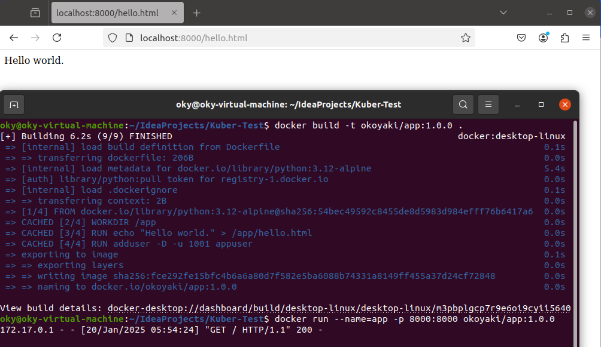
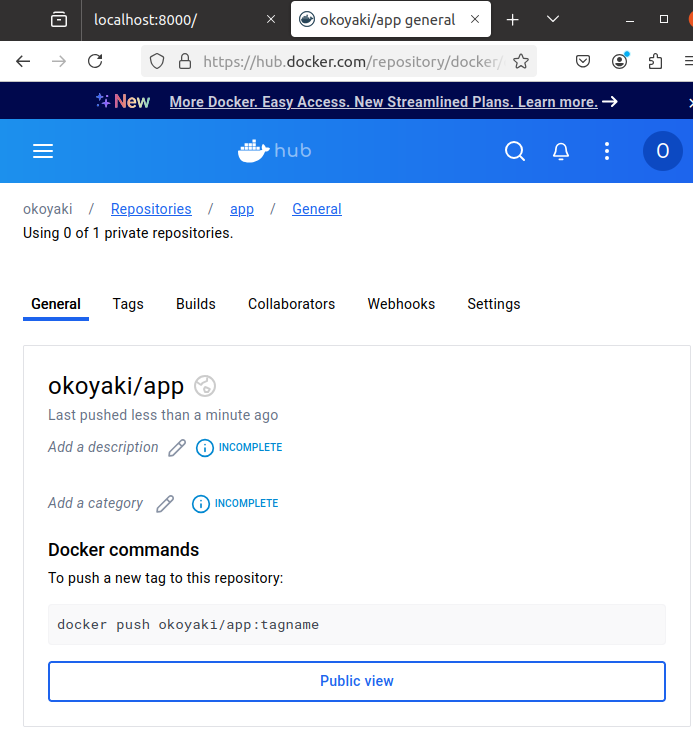
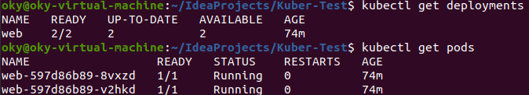
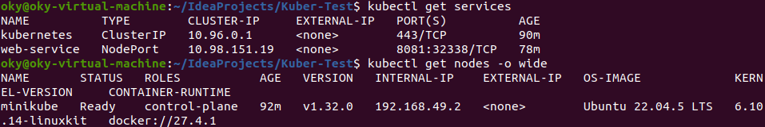
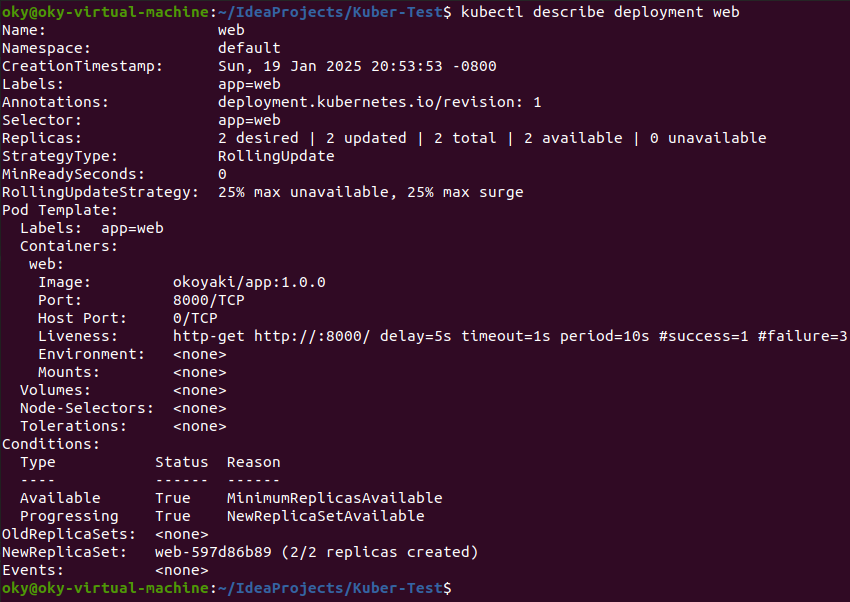
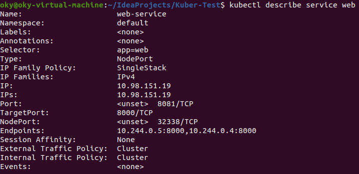
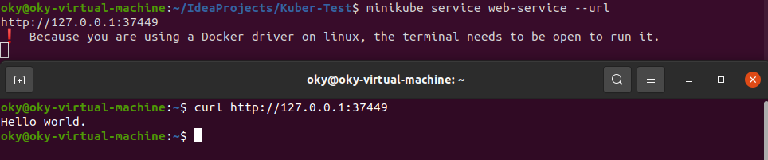

# Kuber-Test
Данный проект был разработан в рамках практического занятия курса "Методология разработки программного обеспечения DevOps".
## 1. Dockerfile
Dockerfile был построен на основе версии Python `python:3.12-alpine`, создает директорию `/app` с файлом `hello.html`, содержащим текст Hello World. Также создает пользователя appuser с UID 1001, от которого затем запускается веб-сервер, через команду `python -m http.server 8000`.

Полученный Dockerfile был собран с названием app:1.0.0 и запущен в контейнере. Запуск веб-приложения прошёл успешно:

Далее полученный image был залит на Docker Hub: https://hub.docker.com/r/okoyaki/app

## 2. Kubernetes
Создан файл deployment.yaml, который является Deployment manifest, запускающим контейнер из созданного image app:1.0.0. Название деплоймента - web, назначенное количество запущенных реплик - 2, также было добавлено использование Probes в виде livenessProbe.

Далее созданный manifest был установлен в кластер Kubernetes. Для работы с кластерами использовался minikube.

Для обеспечения доступа к веб-приложению был создан Service service.yaml. В качестве типа сервиса `type` был взят NodePort; в `selector` указан под web, являющийся Deployment, который был создан на прошлом шаге; в разделе портов был указан внешний порт `port: 8081` для доступа к сервису и порт `targetPort: 8000`, на котором слушает приложение внутри контейнера. Internal IP - 192.168.49.2, NodePort - 32338.

Результаты выполнения команд `kubectl describe deployment web` и `kubectl describe service web`:

При попытке перехода по адресу через команду `curl http://192.168.49.2:32338/hello.html` ответа со стороны веб-приложения не было, в связи с тем, что оно запускается в docker. При получении прямой ссылки через `minikube service web-service --url` был получен адрес http://127.0.0.1:37449, с которого успешно пришёл ответ:

